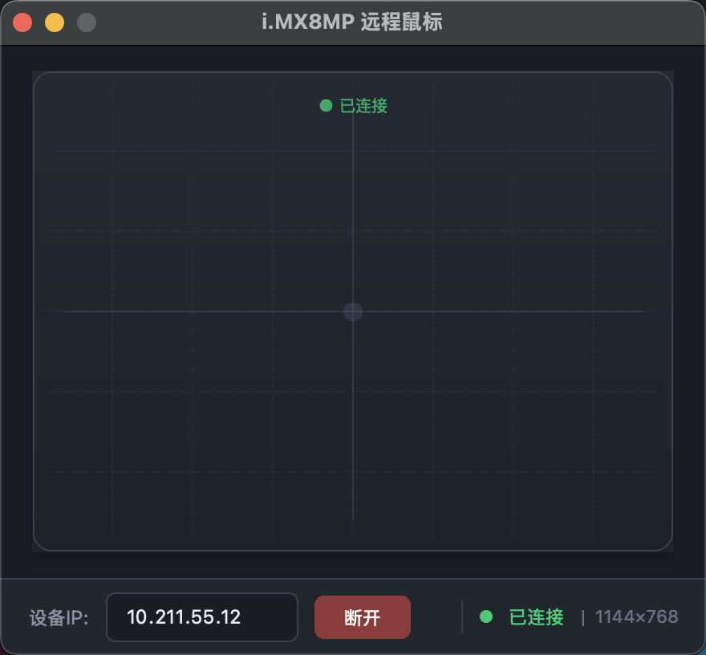

# Remote Mouse (远程鼠标控制系统)

一个基于 C/Qt 开发的跨平台远程鼠标控制系统,包含设备端服务器和图形化客户端,提供直观的触摸板界面来远程控制目标设备。



## 📋 项目简介

本项目是一个完整的远程鼠标控制解决方案,由两部分组成:

- **服务器端** (`remote_mouse_server.c`): 运行在被控设备上,通过 Linux uinput 接口注入鼠标事件
- **客户端** (`remote_mouse_client/`): 基于 Qt 的图形化应用程序,提供触摸板界面发送鼠标控制指令

系统采用 TCP 协议通信,实现低延迟的远程操控体验。

## ✨ 功能特性

### 客户端

- **触摸板控制**: 直观的触摸板界面,支持鼠标移动、左键、右键、中键操作
- **实时连接**: 基于 TCP 协议的低延迟远程控制
- **自动握手**: 连接后自动获取远程设备的屏幕分辨率
- **设备坐标映射**: 自动将触摸板坐标映射到远程设备的实际分辨率
- **状态监控**: 实时显示连接状态、设备分辨率等信息
- **现代化 UI**: 暗色主题,精美的视觉效果
- **跨平台支持**: 支持 Windows 和 macOS 平台 (客户端)

### 服务器端

- **uinput 注入**: 通过 Linux uinput 接口注入鼠标事件到系统
- **自动分辨率检测**: 支持通过 DRM、Framebuffer、xrandr 自动获取屏幕分辨率
- **绝对坐标模式**: 精确的绝对坐标鼠标控制,无累积误差
- **轻量高效**: 纯 C 实现,资源占用极小

## 🖥️ 平台支持

- **服务器端**: Linux (需要 uinput 支持,推荐 i.MX8MP/ROCKCHIP 等嵌入式设备)
- **客户端**: Windows (.ico), macOS (.icns), Linux

## 📦 依赖项

### 服务器端

- Linux 系统 (需要 `/dev/uinput` 权限)
- GCC 编译器
- 标准 C 库

### 客户端

- Qt 5.x 或 Qt 6.x (Core, Widgets, Network 模块)
- C++ 编译器

## 🛠️ 编译与构建

### 服务器端

```bash
# 编译服务器端
gcc -o remote_mouse_server remote_mouse_server.c

# 运行服务器 (自动检测分辨率)
sudo ./remote_mouse_server

# 或者手动指定分辨率
sudo ./remote_mouse_server 1920 1080

# 或者指定端口
sudo ./remote_mouse_server -p 8888 1920 1080
```

**注意**: 服务器需要 root 权限以访问 `/dev/uinput`

### 客户端

```bash
# 1. 进入客户端目录
cd remote_mouse_client

# 2. 生成 Makefile
qmake remote_mouse.pro

# 3. 编译项目
make

# 4. 运行程序
./output/remote_mouse_gui  # macOS/Linux
.\output\debug\remote_mouse_gui.exe  # Windows (Debug)
```

### 清理构建

```bash
# 客户端
cd remote_mouse_client
make clean
# 或删除 output 目录重新构建
```

## 📁 项目结构

```
remote_mouse/
├── remote_mouse_server.c         # 服务器端 (C 语言, Linux uinput)
├── remote_mouse_client/          # 客户端 (Qt 应用程序)
│   ├── main.cpp                  # 应用程序入口
│   ├── remote_mouse_widget.h     # 主窗口头文件
│   ├── remote_mouse_widget.cpp   # 主窗口实现
│   ├── remote_mouse.pro          # Qt 项目配置文件
│   ├── resources.qrc             # Qt 资源文件
│   ├── icons/                    # 图标资源目录
│       ├── logo.png              # PNG 格式图标
│       ├── logo.ico              # Windows 图标
│       ├── logo.icns             # macOS 图标
│       └── app_icon.rc           # Windows 资源配置文件
├── Makefile                      # 主项目 Makefile
└── README.md                     # 项目说明文档
```

## 🚀 使用方法

### 启动服务器端 (在被控设备上)

```bash
# 1. 编译服务器端
gcc -o remote_mouse_server remote_mouse_server.c

# 2. 运行服务器 (自动检测分辨率)
sudo ./remote_mouse_server

# 或者手动指定分辨率和端口
sudo ./remote_mouse_server -p 9999 1920 1080
```

服务器启动后会:

1. 创建虚拟鼠标设备 (通过 uinput)
2. 监听 TCP 端口 (默认 9999)
3. 等待客户端连接
4. 连接后自动发送屏幕分辨率进行握手

### 启动客户端 (在控制设备上)

1. **启动程序**: 运行编译后的可执行文件
2. **输入设备 IP**: 在状态栏的 IP 输入框中输入远程服务器的 IP 地址
3. **连接**: 点击"连接"按钮建立 TCP 连接到远程服务器
4. **远程控制**: 连接成功后,在触摸板区域进行操作:
   - **移动**: 鼠标移动事件会实时发送到远程设备
   - **左键点击**: 单击触摸板
   - **右键点击**: 右键单击
   - **中键点击**: 中键单击
5. **断开连接**: 点击"断开"按钮断开与远程设备的连接

## 📡 通信协议

### 连接建立

1. 客户端连接到服务器的端口 (默认 `9999`)
2. 服务器发送握手数据: 两个 `int32_t` 值(设备宽度 × 设备高度)
3. 客户端获取分辨率后完成握手

### 数据传输

客户端发送鼠标帧数据,每个帧包含 3 个 `int32_t` 值 (12 字节,小端序):

- `abs_x`: 绝对 X 坐标 (设备坐标系,范围 0 ~ screen_width-1)
- `abs_y`: 绝对 Y 坐标 (设备坐标系,范围 0 ~ screen_height-1)
- `buttons`: 按钮状态位掩码
  - Bit 0: 左键
  - Bit 1: 右键
  - Bit 2: 中键

### 服务器端命令行参数

```bash
./remote_mouse_server [-p port] [width height]

参数:
  -p port       TCP 监听端口 (默认: 9999)
  width height  手动指定屏幕分辨率
  -h, --help    显示帮助信息

示例:
  ./remote_mouse_server                      # 自动检测分辨率
  ./remote_mouse_server 1920 1080            # 手动指定 1920x1080
  ./remote_mouse_server -p 8888 1280 720     # 端口 8888, 1280x720
```

## 🎨 界面预览

- **触摸板区域**: 400×300 像素,带有网格线和状态指示
- **状态栏**: 显示连接状态、设备 IP、分辨率信息

## ⚙️ 技术细节

- **坐标映射**: 客户端将触摸板坐标 (400×300) 精确映射到远程设备的实际分辨率
- **低延迟**: 启用 TCP `LowDelayOption` (TCP_NODELAY) 减少延迟
- **线程安全**: 使用 Qt 的事件循环处理网络 I/O
- **输入验证**: IP 地址使用正则表达式验证

## 📝 开发说明

### Qt 配置

项目使用以下 Qt 模块:

- `Qt Widgets`: GUI 界面
- `Qt Network`: TCP 网络通信
- `Qt Core`: 核心功能

## 🐛 故障排除

### 客户端问题

| 问题    | 解决方案                   |
| ----- | ---------------------- |
| 连接失败  | 检查 IP 地址是否正确,确认服务器正在运行 |
| 握手失败  | 确认服务器发送了正确的分辨率数据       |
| 编译错误  | 确保 Qt 开发环境已正确安装        |
| 图标不显示 | 确认图标文件格式正确,重新运行 qmake  |

### 服务器端问题

| 问题               | 解决方案                                       |
| ---------------- | ------------------------------------------ |
| 无法打开 /dev/uinput | 需要 root 权限或使用 `sudo`                       |
| 分辨率检测失败          | 手动指定分辨率: `./remote_mouse_server 1920 1080` |
| 端口已被占用           | 更换端口: `./remote_mouse_server -p 8888`      |
| 客户端连接后立即断开       | 检查防火墙设置,确保端口可访问                            |

## 📄 许可证

本项目仅供学习和参考使用。

## 🤝 贡献

欢迎提交 Issue 和 Pull Request!

## 📧 联系方式

如有问题或建议,请创建 Issue。
